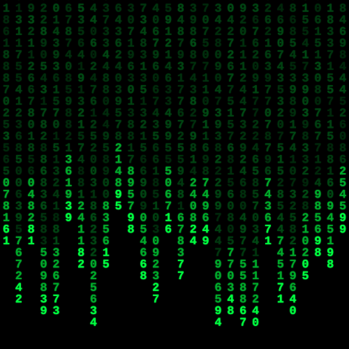

# `ved-ingole`

### AI/ML • Python • Development • Creative Technology

 

<table>
<tr>

<td valign="top">

</td>

<td valign="top">

</td>

</tr>
</table>

---

## 💫 About Me

🎓 BCA 3rd Year student at DY Patil Ambi

🐍 Currently learning **Python & Data Structures and Algorithms**

💻 Building projects to improve my programming and problem-solving skills

🌐 Developed a website for **Deccan EnM Solutions**

🤝 Open to collaborating on **Python, Web Development & AI/ML projects**

🚀 Currently exploring **AI/ML** and working on new projects

⚡ Fun fact: I enjoy combining technology with creativity

---

## 💻 Languages & Technologies

---

## 🤖 AI / ML

---

## 🛠️ Tools

---

## 🎨 Creative

---

## 🚀 Projects

### 🩺 Diabetes Prediction Model
Machine learning model for diabetes prediction and analysis.

### 🌐 Deccan EnM Solutions
Developed a website for Deccan EnM Solutions.

### 🤖 Multiple ML Models
Worked with different machine learning algorithms and datasets.

### 📚 DSA using Python
Practicing data structures and algorithms using Python.

---

## 📫 Connect With Me

---

`Building • Learning • Creating`

